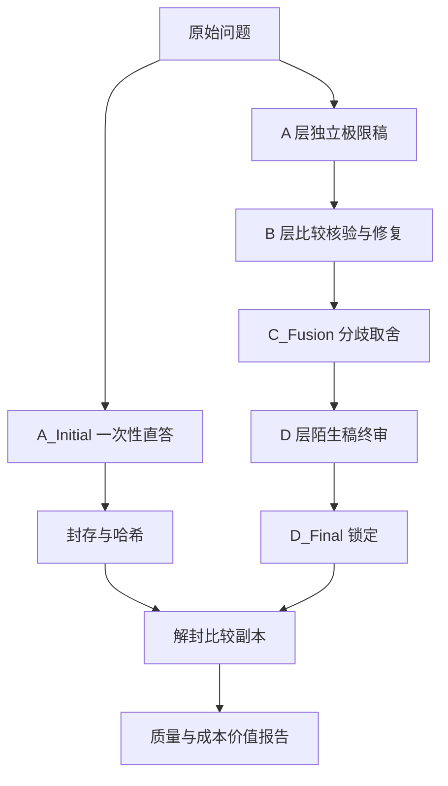

# 系统架构

```mermaid
flowchart TD
  Q[原始问题] --> I[A_Initial 一次性直答]
  I --> S[封存与哈希]
  Q --> A[A 层独立极限稿]
  A --> B[B 层比较核验与修复]
  B --> C[C_Fusion 分歧取舍]
  C --> D[D 层陌生稿终审]
  D --> L[D_Final 锁定]
  S --> V[解封比较副本]
  L --> V
  V --> R[质量与成本价值报告]
```

核心资产由注册表定位并只读装载；运行产物与核心资产物理分离。

